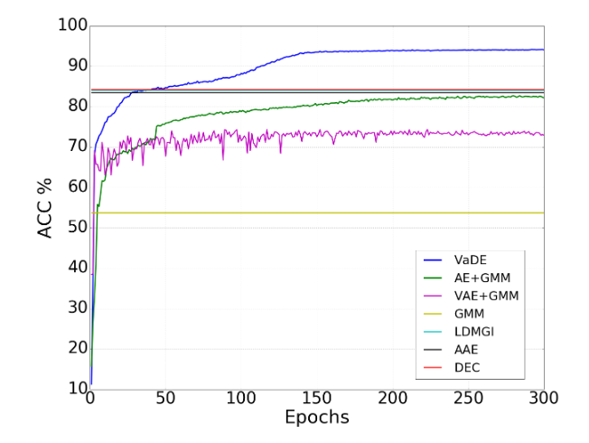

# aiClustering
This repository contains the Python implementation for a generative clustering method. 

Further details about this method can be found in the following paper:
Variational Deep Embedding : A Generative Approach to Clustering Requirements

Requirements
=================
* Python-3.4.4
* keras-1.1.0
* scikit-learn-1.17.1

**Replace** `keras/engine/training.py` by `training.py` in this repository!!

(The modification version of `keras/engine/training.py` enables the simultaneous updating of the gmm parameters and the network parameters in this model.)

Usage
=================

* To train the model on the MNIST, Reuters, HHAR datasets:
```shell
python ./VaDE.py db
```
db can be one of mnist,reuters10k,har.

* To achieve the 94.46% clustering accuracy on the MNIST dataset and generate the class-specified digits (Note that: unlike Conditional GAN, this method does not use any supervised information during training):
```shell
python ./VaDE_test_mnist.py
```

* To achieve the 79.38% clustering accuracy on the Reuters(685K) dataset:
```shell
cd $VaDE_ROOT/dataset/reuters
./get_data.sh
cd $VaDE_ROOT
python ./VaDE_test_reuters_all.py
```

**Note**: the data preprocessing code for the Reuters dataset is taken from (https://github.com/piiswrong/dec).



